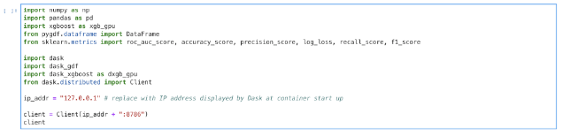

## Introduction to RAPIDS

##### The RAPIDS data science framework includes a collection of libraries for executing end-to-end data science pipelines completely in the GPU. It is designed to have a familiar look and feel to data scientists working in Python. Here’s a code snippet where we read in a CSV file and output some descriptive statistics.

```python
import cudf
gdf = cudf.read_csv(‘path/to/file.csv’)
for column in gdf.columns:
    print(column.mean())
```

RAPIDS uses optimized NVIDIA® CUDA® primitives and high-bandwidth GPU memory to accelerate data preparation and machine learning. The goal of RAPIDS is not only to accelerate the individual parts of the typical data science workflow, but to accelerate the complete end-to-end workflow.

We suggest that you take a look at the sample workflow in our Docker container (described below), which illustrates just how straightforward a basic XGBoost model training and testing looks in RAPIDS.

## Install Conda Package

##### The fastest way to use cuDF is through conda.

### Prerequisites

* NVIDIA Pascal™ GPU architecture or better
* CUDA [9.2](https://developer.nvidia.com/cuda-92-download-archive) or [10.0](https://developer.nvidia.com/cuda-downloads)
* Ubuntu 16.04 or 18.04

### Conda Install

You can get a minimal conda installation with [Miniconda](https://conda.io/miniconda.html) or get the full installation with [Anaconda](https://www.anaconda.com/download).

Install and update cuDF using the conda command:

```bash
conda install -c numba -c conda-forge -c rapidsai -c defaults cudf=0.2.0
```

For a complete conda development environment see the [cuDF README](https://github.com/rapidsai/cudf#conda) for more information.

## Run a RAPIDS Container

##### The RAPIDS Docker containers are configured to run RAPIDS and provide example notebooks to get started quickly.

### Prerequisites

* NVIDIA Pascal™ GPU architecture or better
* CUDA [9.2](https://developer.nvidia.com/cuda-92-download-archive) or [10.0](https://developer.nvidia.com/cuda-downloads)
* Ubuntu 16.04 or 18.04
* Docker CE v18+
* [nvidia-docker](https://github.com/nvidia/nvidia-docker/wiki/Installation-(version-2.0)) v2+

### What’s Included in the Container

* Conda environment with compiled RAPIDS libraries
* Jupyter notebook server and demo notebooks
* Partial mortgage demo dataset

### Run a RAPIDS Container

#### Start with Notebook Server

```bash
docker pull rapidsai/rapidsai:latest
docker run --runtime=nvidia -p 8888:8888 -p 8787:8787 -p 8790-8798:8790-8798 -it rapidsai/rapidsai:latest
```
**NOTE:** This container runs [JupyterLab](https://jupyterlab.readthedocs.io/en/stable/) on start, which will be accessible at port 8888 on your host machine with a default token/password of `rapids`.

#### Start with BASH CLI

```bash
docker pull rapidsai/rapidsai:latest
docker run --runtime=nvidia -it rapidsai/rapidsai:latest bash
```

#### Use cuDF and conda Environment

The container is configured with cuDF and related packages in the `cudf` conda environment. To activate and use this environment inside the container, run:

```bash
source activate cudf
```
**NOTE:** This is not necessary to do when using the notebook server, only when developing on the command line of the container.

<section class="intro-content ">
    <div class="documentation-gray-top"></div>
    <div class="documentation-inner-content">
        <div class="fixed-content">
            <div class="getting-started-small-warp">
                <h2>Jupyter Notebooks</h2>

                <h3>1. Getting Started Notebook</h3>
                <p>This notebook walks you through a tour of some of the basic functionality of cuDF. This uses an
                    included dataset taken from the US Census.</p>
                <div class="programing-box white-box">
                    
                </div>

                <h3>2. Mortgage_ETL_XGBoost</h3>
                <p>This notebook shows an end-to-end workflow that you might find in the financial sector. The data is
                    the month-by-month history of mortgages made in the first quarter of 2017.</p>
                <div class="programing-box">
                    
                </div>
                <p>The program then performs various variable transformations and joins on the data.</p>
                <div class="programing-box white-box">
                    
                </div>
                <p>Finally, a very simple model predicting default probability is fit using XGBoost.</p>
                <div class="programing-box white-box">
                    
                </div>
                <h3>3. Mortgage_Pandas</h3>
                <p>This notebook shows the same workflow as the above, but written entirely without cuDF. You’ll notice
                    that the API is very similar, and in some cases identical, but that the time to complete the
                    workflow is much less in cuDF. </p>

                <h3>4. dask_gdf_etl_to_ml</h3>
                <p>This notebook executes the complete end-to-end data science workflow seen in the Mortgage_ETL_XGBoost
                    notebook, but uses multiple GPUs in parallel.</p>
                
                <div class="programing-box white-box">
                    
                </div>

                <h3>5. dask_gdf_ml </h3>
                <p>This notebook reads in data that has already had ETL and feature engineering performed, and then fits
                    and evaluates and XGBoost model.</p>
                <div class="programing-box white-box">
                    
                </div>
            </div>
        </div>
    </div>
</section>

<section class="footer-cta-main">
    <div class="fixed-content">
        <h2>Join the Community</h2>
        <p>Learn how you can be an adopter, contributor, and more.</p>
        <a href="community.html" class="blue-btn">Join Today</a>
    </div>
</section>
