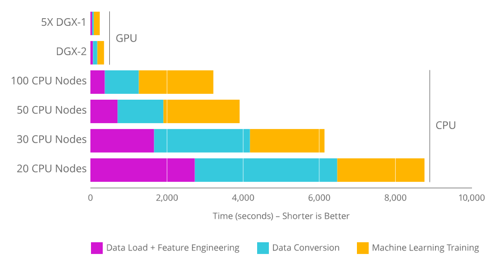

<section class="about-rapids">
    

        <h2>About RAPIDS</h2>
        
The RAPIDS suite of open source software libraries gives you the freedom to execute end-to-end data science and analytics
            pipelines entirely on GPUs. It relies on <a href="https://developer.nvidia.com/cuda-toolkit"
                                                        target="_blank">NVIDIA® CUDA® </a> primitives for low-level
            compute optimization, but exposes that GPU parallelism and high-bandwidth memory speed through user-friendly
            Python interfaces.     RAPIDS also focuses on common data preparation tasks for analytics and data
            science. This includes a familiar DataFrame API that integrates with a variety of machine learning
            algorithms for end-to-end pipeline accelerations without paying typical serialization costs. RAPIDS also
            includes support for multi-node, multi-GPU deployments, enabling vastly accelerated processing and training
            on much larger dataset sizes. 

        

              
             
             
        

    

</section>

<section class="gpu-pipeline">
    

    

        

            <h2>The New GPU   Data Science Pipeline</h2>
            

            

                <!--
                

                    
                    Apache   Arrow
                

                -->
            

            

                <ul>
                    <li>Apache Arrow This is a columnar, in-memory data structure that delivers efficient and fast data interchange with flexibility to support complex data models.
                    </li>
                    <li>cuDFThe RAPIDS cuDF library is a DataFrame manipulation library based on Apache Arrow that accelerates loading, filtering, and manipulation of data for model training data preparation. The Python bindings of the core-accelerated CUDA DataFrame manipulation primitives mirror the pandas interface for seamless onboarding of pandas users.
                    </li>
                    <li>cuMLRAPIDS cuML is a collection of GPU-accelerated machine learning libraries that will provide GPU versions of all machine learning algorithms available in scikit-learn.
                    </li>
                </ul>

                <ul>
                    <li>cuGRAPHThis is a framework and collection of graph analytics libraries that seamlessly integrate into the RAPIDS data science platform.
                    </li>
                    <li>Deep Learning LibrariesRAPIDS provides native array_interface support. This means data stored in Apache Arrow can be seamlessly pushed to deep learning frameworks that accept array_interface such as PyTorch and Chainer.
                    </li>
                    <li>Visualization Libraries Coming SoonRAPIDS will include tightly integrated data visualization libraries based on Apache Arrow. Native GPU in-memory data format provides high-performance, high-FPS data visualization, even with very large datasets.
                    </li>
                </ul>
            

        

    

</section>

<section class="features-main">
    

        

            <h2>Features of RAPIDS </h2>

            

                <ul>
                    <li>
                        
                        <h3>Hassle-Free Integration</h3>
                        
Accelerate your Python data science toolchain with minimal code changes and no new tools to
                            learn.

                    </li>

                    <li>
                        
                        <h3>Scaling Out   on Any GPU</h3>
                        
Seamless scale from GPU workstations to multi-GPU servers and multi-node clusters.

                    </li>

                    <li>
                        
                        <h3>Top Model Accuracy</h3>
                        
Increase machine learning model accuracy by iterating on models faster and deploying them
                            more frequently.

                    </li>
                </ul>
            

            

                <ul>

                    <li>
                        
                        <h3>Reduced   Training Time</h3>
                        
Drastically improve your productivity with near-interactive data science.

                    </li>

                    <li>
                        
                        <h3>Open   Source</h3>
                        
The open-source software is customizable, extensible, interoperable--supported by NVIDIA and
                            built on Apache Arrow.

                    </li>
                </ul>
            

        

    

    

</section>

<section class="community-main">
    

        

            <h2>Community</h2>
            
RAPIDS is for everyone--users, adopters, and contributors. If you’re a data scientist, researcher,
                engineer, or developer using pandas, Dask, scikit-learn, or Spark on CPUs and looking for 50X end-to-end
                pipeline speedups at scale, look no further. Downloads RAPIDS and give us a run. RAPIDS is open sourced
                under the Apache 2.0 open source license and intended to be built upon and hardened in the community.
                While significant time and effort has been invested into making the platform usable and relevant, we
                need active contributors to help improve it and build its future.

            <a href="community.html" class="blue-btn">JOIN NOW</a>
        

    

</section>

<section class="contributing-partner">
    

        <h3>Community Contributors</h3>
        

            

                
            

            

                
            

            

                
            

            

                
            

            

                
            

            

                
            

        

    

</section>

<section class="contributing-partner">
    

        <h3>Ecosystem Partners</h3>
        

            
            

                
            

            
            

                
            

            
            

                
            

            
            

                
            

           
            

                
            

            

                
            

            

                
            

            

                
            

            

                
            

            

                
            

            

                
            

            

                
            

        

    

</section>

<section class="footer-cta-main">
    

        <h2>Experience Data Science on GPUs with RAPIDS</h2>
        <a href="documentation.html" class="blue-btn">GET STARTED</a>
    

</section>
